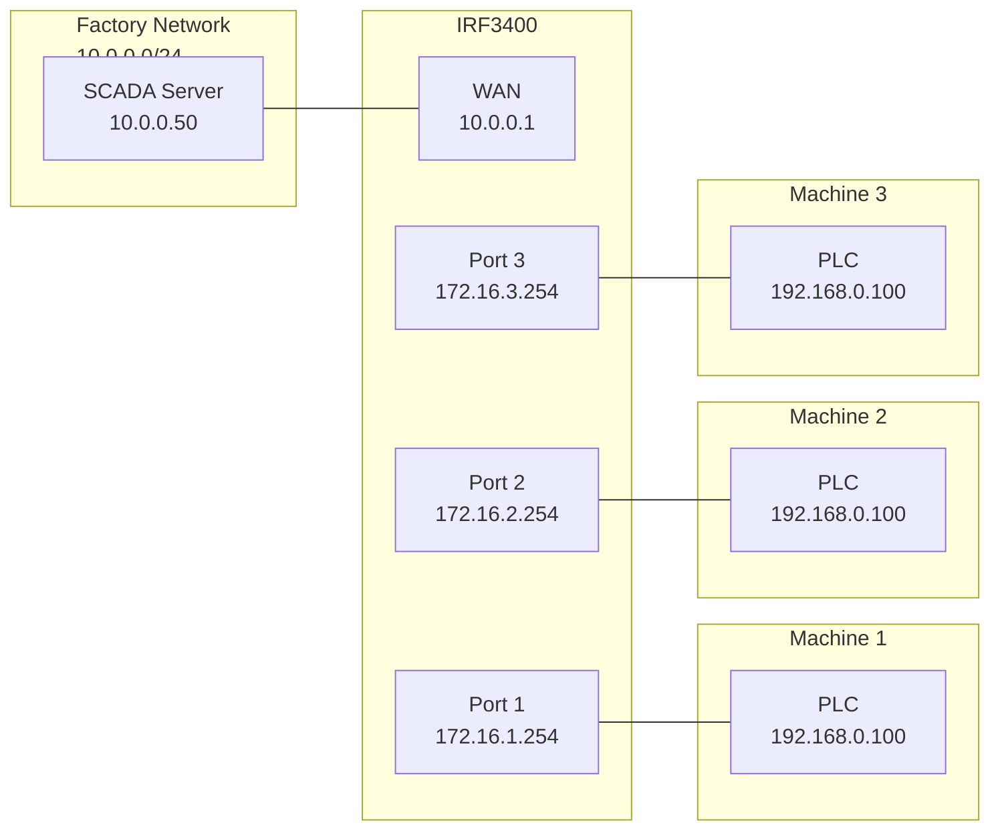

# 1:1 NAT (Network Mapping)

!!! note "Firewall models only"
    1:1 NAT is available on IRF1000, IRF2000, and IRF3000 firewalls in IP-Router mode. The IRF3400 supports up to 4 independent networks (WAN + 3 LAN ports), and the IRF3800 supports up to 8 (WAN + 7 LAN ports).

1:1 NAT maps an entire subnet to a different subnet by replacing the network prefix while preserving the host portion. The most common use case is connecting multiple machines that all ship with the same fixed IP range (e.g., 192.168.0.0/24) to a single firewall — each machine network gets its own unique virtual address range so they can coexist without conflicts.

## How It Works

Unlike port forwarding which translates individual addresses and ports, 1:1 NAT performs a prefix substitution on every packet crossing the interface:

| Direction | Original Address | Translated Address |
|---|---|---|
| Incoming (from factory to machine) | 10.0.0.50 (factory PC) | No change (unique range, no conflict) |
| Outgoing (from machine to factory) | 192.168.0.100 (real machine address) | 172.16.1.100 (virtual) |

The host portion (`.100`) is always preserved — only the network prefix changes.

### Terminology

| Term | Meaning |
|---|---|
| **Private subnet** | The real IP range behind the interface (the addresses the machine's devices actually use) |
| **Public subnet** | The virtual IP range the interface presents to the rest of the network |
| **Double sided network mapping** | Extended mode where traffic in *both* directions is translated — needed when the opposite network also has a conflicting address range |

## Configuration Variables

1:1 NAT is configured entirely through config variables — there is no table involved.

| Variable | Values | Description |
|---|---|---|
| `{iface}_ipaddr` | IP address | Must be set to the **virtual** IP when 1:1 NAT is enabled |
| `{iface}_netmask` | Netmask | Subnet mask for the virtual range |
| `{iface}_netmap_status` | `"enabled"` / `"disabled"` | Enable 1:1 NAT on this interface |
| `{iface}_netmap_subnet` | IP/CIDR | The **real** (private) subnet behind this interface |
| `{iface}_netmap_ext_status` | `"enabled"` / `"disabled"` | Enable double sided network mapping |
| `{iface}_netmap_ext_subnet` | IP/CIDR | The virtual range under which the opposite network appears to this interface's devices |

Where `{iface}` is `wan`, `lan`, `lan_port1`–`lan_port7`, etc.

See the [Configuration Database](../api-reference/configdb/index.md) reference (section "Packet Filter & NAT > 1:1 NAT") for the full list.

## Example: Multiple Machines with Identical Networks

### Scenario

A production hall has three machines, each delivered with the same fixed network 192.168.0.0/24. The machines are connected to an IRF3400 firewall (IP-Router Extended mode), which provides an uplink to the factory network (10.0.0.0/24):

| Port | Connected to | Real subnet |
|---|---|---|
| **WAN** | Factory network (uplink) | 10.0.0.0/24 |
| **LAN Port 1** | Machine 1 (CNC mill) | 192.168.0.0/24 |
| **LAN Port 2** | Machine 2 (Robot cell) | 192.168.0.0/24 |
| **LAN Port 3** | Machine 3 (Packaging line) | 192.168.0.0/24 |

Without NAT, the firewall cannot route between the three machine networks because they all share the same address range.

### Solution

Assign each machine network a unique virtual range:

| Port | Virtual range | Example: PLC at real 192.168.0.100 |
|---|---|---|
| LAN Port 1 | 172.16.1.0/24 | Reachable as **172.16.1.100** |
| LAN Port 2 | 172.16.2.0/24 | Reachable as **172.16.2.100** |
| LAN Port 3 | 172.16.3.0/24 | Reachable as **172.16.3.100** |

A SCADA server on the factory network (10.0.0.50) reaches all three PLCs at their unique virtual addresses. The PLCs themselves remain untouched at 192.168.0.100 — only the firewall translates.

### Prerequisites

The firewall must be in **IP-Router Extended** (`iprouter5port`) mode so each LAN port operates as an independent routed interface:

```python
import jsonrpcdevice

dev = jsonrpcdevice.AdstecJSONRPCDevice("192.168.0.254", "admin", "admin")

# Ensure IP-Router Extended mode
opmode = dev.config_get(["opmode"])["result"][0]["opmode"]
if opmode != "iprouter5port":
    dev.config_set_commit({"opmode": "iprouter5port"})
```

!!! warning
    Changing `opmode` has side effects on filter rules and static routes.

### Step 1: Configure Interface IPs

Set each LAN port's IP address to its virtual range. The WAN uplink keeps a normal address in the factory network:

```python
dev.config_set_commit({
    # WAN — uplink to factory network
    "wan_ipaddr": "10.0.0.1",
    "wan_netmask": "255.255.255.0",
    "lan_gateway": "10.0.0.254",
    # LAN Port 1 — virtual range for Machine 1
    "lan_port1_ipaddr": "172.16.1.254",
    "lan_port1_netmask": "255.255.255.0",
    # LAN Port 2 — virtual range for Machine 2
    "lan_port2_ipaddr": "172.16.2.254",
    "lan_port2_netmask": "255.255.255.0",
    # LAN Port 3 — virtual range for Machine 3
    "lan_port3_ipaddr": "172.16.3.254",
    "lan_port3_netmask": "255.255.255.0",
})
```

!!! note
    On each LAN port, the interface IP (e.g., 172.16.1.254) becomes the default gateway for the machine network behind it. The machines themselves must have their gateway set to 192.168.0.254 — the NAT translates this to the virtual address automatically.

### Step 2: Enable 1:1 NAT on Each LAN Port

Enable network mapping on each port and specify the real machine subnet:

```python
dev.config_set_commit({
    "lan_port1_netmap_status": "enabled",
    "lan_port1_netmap_subnet": "192.168.0.0/24",
    "lan_port2_netmap_status": "enabled",
    "lan_port2_netmap_subnet": "192.168.0.0/24",
    "lan_port3_netmap_status": "enabled",
    "lan_port3_netmap_subnet": "192.168.0.0/24",
})
```

After this step, the factory network can reach each machine's devices through their unique virtual addresses (172.16.1.x, 172.16.2.x, 172.16.3.x).

### Step 3: Save Settings

```python
dev.config_set_commit({"save_now": "1"})
dev.logout()
```

### Complete Script

```python
import jsonrpcdevice

host = "192.168.0.254"
dev = jsonrpcdevice.AdstecJSONRPCDevice(host, "admin", "admin")

# Machine networks to configure — extend for IRF3800 (up to lan_port7)
machines = {
    "lan_port1": {"virtual": "172.16.1", "real_subnet": "192.168.0.0/24"},
    "lan_port2": {"virtual": "172.16.2", "real_subnet": "192.168.0.0/24"},
    "lan_port3": {"virtual": "172.16.3", "real_subnet": "192.168.0.0/24"},
}

# Step 1: Set interface IPs
ip_config = {
    "wan_ipaddr": "10.0.0.1",
    "wan_netmask": "255.255.255.0",
    "lan_gateway": "10.0.0.254",
}
for port, cfg in machines.items():
    ip_config[f"{port}_ipaddr"] = f"{cfg['virtual']}.254"
    ip_config[f"{port}_netmask"] = "255.255.255.0"

dev.config_set_commit(ip_config)

# Step 2: Enable 1:1 NAT on each machine port
nat_config = {}
for port, cfg in machines.items():
    nat_config[f"{port}_netmap_status"] = "enabled"
    nat_config[f"{port}_netmap_subnet"] = cfg["real_subnet"]

dev.config_set_commit(nat_config)

# Step 3: Persist
dev.config_set_commit({"save_now": "1"})

dev.logout()
print("1:1 NAT configured for", len(machines), "machine networks")
```

### Address Mapping at a Glance



| From | To | Use address |
|---|---|---|
| SCADA server | Machine 1 PLC (real: 192.168.0.100) | **172.16.1.100** |
| SCADA server | Machine 2 PLC (real: 192.168.0.100) | **172.16.2.100** |
| SCADA server | Machine 3 PLC (real: 192.168.0.100) | **172.16.3.100** |
| Any machine PLC | SCADA server (10.0.0.50) | **10.0.0.50** (no conflict) |
| Any machine PLC | Firewall | **192.168.0.254** (their gateway) |

## Double Sided Network Mapping

Double sided mapping is needed when the network on the *opposite* side of the NAT interface also has a conflicting address range. A typical case is when the factory network itself uses the same 192.168.0.0/24 range as the machines.

In that situation, basic 1:1 NAT is not sufficient — the machine network and the factory network would both be 192.168.0.0/24, and the firewall cannot route between them. Double sided mapping adds a second translation layer: traffic leaving through the NAT interface has its source address rewritten to a virtual range, so the machines see the factory network under a unique address.

### Example: Factory and Machine Share 192.168.0.0/24

```python
# WAN interface uses a virtual IP (factory is also 192.168.0.0/24)
dev.config_set_commit({
    "wan_ipaddr": "172.16.0.112",
    "wan_netmask": "255.255.255.0",
    "lan_gateway": "172.16.0.1",
})

# Enable 1:1 NAT on WAN — map virtual range to real factory network
dev.config_set_commit({
    "wan_netmap_status": "enabled",
    "wan_netmap_subnet": "192.168.0.0/24",
})

# Enable double sided mapping — factory devices see the LAN under 172.17.1.0/24
dev.config_set_commit({
    "wan_netmap_ext_status": "enabled",
    "wan_netmap_ext_subnet": "172.17.1.0/24",
})
```

With this configuration:

- LAN devices reach factory hosts using 172.16.0.x virtual addresses
- Factory hosts reach LAN devices using 172.17.1.x virtual addresses
- Neither side needs to change its real IP configuration

## Reading 1:1 NAT Configuration

```python
# Read NAT config for all LAN ports
variables = []
for i in range(1, 4):
    port = f"lan_port{i}"
    variables.extend([
        f"{port}_netmap_status",
        f"{port}_netmap_subnet",
        f"{port}_netmap_ext_status",
        f"{port}_netmap_ext_subnet",
    ])

result = dev.config_get(variables)
for entry in result["result"]:
    for key, value in entry.items():
        print(f"{key} = {value}")
```

## Disabling 1:1 NAT

```python
dev.config_set_commit({
    "lan_port1_netmap_status": "disabled",
    "lan_port1_netmap_ext_status": "disabled",
})
```

!!! warning
    After disabling 1:1 NAT on an interface, restore its IP address to the real subnet and update routes accordingly.

## Subnet Size Mismatch

If the public and private subnets have different prefix lengths, the firewall uses the **smaller** subnet (larger CIDR number). For example, mapping a /24 to a /25 means only 126 host addresses are translated 1:1 — the remaining addresses in the larger range have no unique mapping partner.

!!! tip
    Use identically sized subnets for predictable results.

## Interaction with Other Features

### Port Forwarding

Port forwarding rules operate independently of 1:1 NAT. If both are active on the same interface, port forwarding is evaluated first (PREROUTING chain). Use virtual addresses in forwarding rules when 1:1 NAT is enabled.

### Packet Filter

Packet filter rules on the firewall must use **virtual** (public) addresses, not the real private addresses. The NAT translation happens before filtering.

### VPN / Remote Maintenance

VPN tunnels (IPsec, OpenVPN, Big-LinX) see the **virtual** (public) addresses, not the real private ones. Remote maintenance must use the virtual addresses to reach machine devices (e.g., 172.16.1.100 for Machine 1's PLC, not 192.168.0.100).

### DHCP Interfaces

1:1 NAT also works on interfaces using DHCP. The private subnet is derived automatically from the DHCP lease. The `_netmap_subnet` variable is only used for interfaces with `static` protocol.
