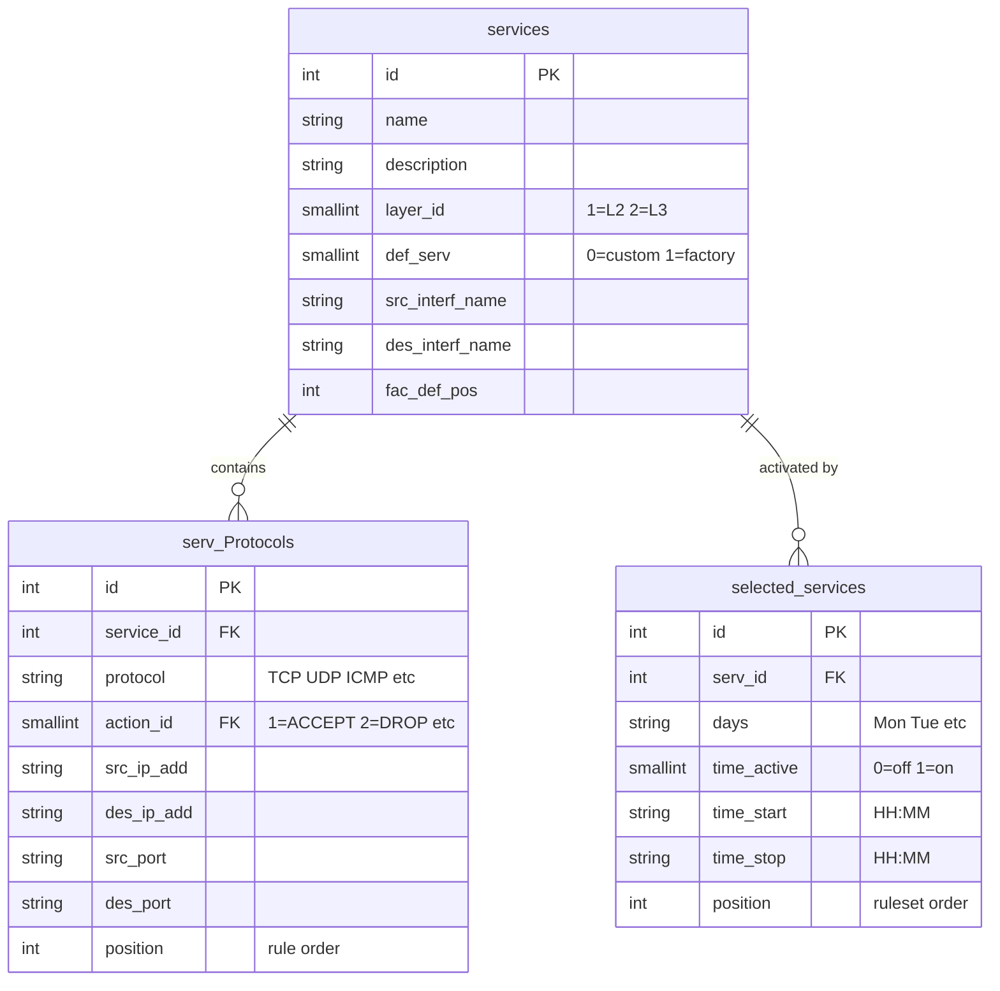

# Packet Filter

!!! note "Firewall models only"
    Packet filter configuration is available on IRF1000, IRF2000, and IRF3000 firewalls.

The packet filter controls forwarded traffic through the firewall. It uses three interrelated tables that define rulesets, individual rules, and which rulesets are active.

## Data Model Overview

The packet filter uses a 3-tier table architecture:



- **[`services`](tables.md#services)** — Rulesets (groups of rules). Each ruleset operates at either Layer 2 (ebtables) or Layer 3 (iptables).
- **[`serv_Protocols`](tables.md#serv_protocols)** — Individual filter rules within a ruleset. Each rule specifies match criteria (protocol, addresses, ports) and an action.
- **[`selected_services`](tables.md#selected_services)** — Activates a ruleset with an optional time-based schedule.

Two read-only lookup tables provide reference data:

- **`protocols`** — Maps protocol names (`TCP`, `UDP`, `ICMP`) to numeric values for iptables
- **`actions`** — Maps action IDs to names (`ACCEPT`, `DROP`, etc.)

Address groups from the [`ipgroups` and `macgroups`](../../api-reference/firewall/tables.md#ipgroups-network-groups) tables can be referenced in rules using the `@groupname` syntax.

## Scope and Interfaces

!!! warning "FORWARD chain only — traffic *to* the device is not filtered"
    The packet filter applies exclusively to the **iptables/ebtables FORWARD chain** — only packets that pass *through* the device from one interface to another. Traffic addressed **to the device itself** (e.g. management access, web UI, SSH, ping to the device's own IP) uses the INPUT chain and is **not** subject to packet filter rules. You cannot use the packet filter to log or block traffic destined for the device's own IP addresses.

The available interfaces depend on the device model, the operating mode, and the filter layer:

- **Layer 2** (ebtables) operates on bridge member ports — only interfaces that are part of a bridge (`br0`, `br1`) can be filtered at L2.
- **Layer 3** (iptables) operates on standalone interfaces that are not part of a bridge (e.g. routed interfaces, VPN tunnels).

### IRF1000

The IRF1000 has 3 LAN ports and 1 WAN port. The 3 LAN ports are connected through a **hardware switch** and appear as a single interface (`eth0`) to the operating system — traffic between the LAN ports cannot be filtered.

| Operating Mode | `eth0` (LAN) | `eth1` (WAN) | Bridges | L2 Filtering | L3 Filtering |
|---|---|---|---|---|---|
| **Transparent Bridge** | member of `br0` | member of `br0` | `br0` = eth0 + eth1 | Yes, between eth0 and eth1 | Not available |
| **IP-Router** | standalone | standalone | none | Not available | Yes |

In **Transparent Bridge** mode, both interfaces are members of `br0`. Traffic flowing between the LAN ports (`eth0`) and the WAN port (`eth1`) passes through the bridge and can be filtered at L2. L3 filtering is not available since there are no standalone interfaces.

In **IP-Router** mode, `eth0` and `eth1` are separate routed interfaces. Only L3 filtering is available.

### IRF2000

The IRF2000 comes in two hardware variants: **IRF22xx** (2 Ethernet ports: 1 LAN, 1 WAN) and **IRF26xx** (6 Ethernet ports). The IRF2000 has separate LAN and WAN bridges, enabling L2 filtering between the two segments.

| Operating Mode | LAN | WAN | Bridges | L2 Filtering | L3 Filtering |
|---|---|---|---|---|---|
| **Transparent Bridge** | members of `br0` | members of `br1` | `br0` (LAN), `br1` (WAN) | Yes, between `br0` and `br1` | Not available |
| **IP-Router** | members of `br0` | standalone | `br0` (LAN) | Between `br0` members only | Yes |
| **IP-Router Extended** | all standalone by default | `br1` available, empty by default | `br1` (optional) | Between `br1` members (if configured) | Yes |

In **IP-Router Extended** mode, all interfaces are standalone routed interfaces by default. The `br1` bridge is available but not started — the user can optionally assign interfaces to it. L3 filtering works on standalone interfaces; L2 filtering is available between `br1` members if any are configured.

### IRF3000

The IRF3000 comes in two hardware variants: **IRF34xx** (4 Ethernet ports) and **IRF38xx** (8 Ethernet ports). Interface names are uppercase (`ETH1`, `ETH2`, ..., `ETH8`), matching the labels printed on the device hardware.

The IRF3000 supports three operating modes:

| Operating Mode | LAN Interfaces | WAN Interfaces | Bridges | L2 Filtering | L3 Filtering |
|---|---|---|---|---|---|
| **Transparent Bridge** | members of `br0` | members of `br1` | `br0` (LAN), `br1` (WAN) | Yes, between `br0` and `br1` | Not available |
| **IP-Router** | `ETH1`–`ETH4` (or `ETH8`) on `br0` | `br1` freely configurable | `br0` (LAN), `br1` (WAN) | Between bridge members | Yes |
| **IP-Router Extended** | all standalone by default | `br1` available, empty by default | `br1` (optional) | Between `br1` members (if configured) | Yes |

In **IP-Router** mode, the LAN bridge (`br0`) contains `ETH1` through `ETH4` (IRF34xx) or `ETH8` (IRF38xx). The WAN bridge (`br1`) can be freely configured with any remaining interfaces. L2 filtering operates between bridge members, L3 filtering on standalone interfaces.

In **IP-Router Extended** mode, all interfaces are standalone routed interfaces by default. The `br1` bridge is available but not started — the user can optionally assign interfaces to it. L3 filtering works on standalone interfaces; L2 filtering is available between `br1` members if any are configured.

!!! tip "IP-Router Extended for maximum filter granularity"
    IP-Router Extended mode (available on IRF2000 and IRF3000) gives the most control — each physical port is a separate L3 interface that can be used in directional rulesets. This is the recommended mode when per-port filtering is required.

### Additional Interfaces

Beyond the physical Ethernet ports, the following virtual interfaces can appear in filter rules when their respective features are enabled:

| Interface | Type | Description |
|---|---|---|
| `wwan1` | L3 standalone | Mobile network (cellular modem) |
| `l3tap0`–`l3tap9` | L3 standalone | OpenVPN tunnels in Layer 3 (TAP) mode |
| `l3tap10` | L3 standalone | Big-LinX VPN tunnel |
| `ipsec0` | L3 standalone | Virtual interface for all IPsec traffic |
| `docker0` | L3 standalone | Bridge to the device's Docker engine |
| `l2tap0`–`l2tap9` | L2 bridged to `br0` | OpenVPN tunnels in Layer 2 mode |

L3 standalone interfaces can be used in L3 filter rules like any physical port. The L2 OpenVPN tunnels (`l2tap0`–`l2tap9`) are always bridged to `br0` and can be filtered at L2 as bridge members.

!!! warning "No interface validation"
    The packet filter accepts **any** interface name in `src_interf_name` and `des_interf_name` — including interfaces that do not exist on the current device model or are not valid for the active operating mode. Rules referencing non-existent interfaces are silently ignored. It is the user's responsibility to ensure that the interface names used in rulesets match the actual device configuration.

### Interface Name Aliases

The web UI displays user-friendly aliases (e.g., "LAN", "WAN", "WWAN") instead of the Linux interface names (e.g., `br0`, `br1`, `wwan1`). The packet filter tables and the [event log](../../api-reference/firewall/status-properties.md#packet-filter-log-format) both use the **alias names** — so `IN=ETH7` in a log line matches the label you see in the web UI.

On IRF3000 devices, the physical port names (`ETH1`–`ETH8`) are the same in both the UI and Linux, so no translation is needed. For other interfaces, the mapping is stored in `{interface}_name` configuration variables:

```python
# Query interface alias mappings
aliases = [
    "br0_name", "br1_name", "bond0_name", "wwan1_name",
    "l3tap0_name", "l3tap10_name", "ipsec0_name",
    "docker_name", "ppp0_name",
    "lan_port1_name", "lan_port2_name", "lan_port3_name",
    "lan_port4_name", "lan_port5_name", "lan_port6_name",
    "lan_port7_name",
]
for name in aliases:
    result = dev.config_get([name])
    value = result.get("result", [{}])[0].get(name, "")
    if value:
        iface = name.replace("_name", "")
        print(f"{iface:15s} -> {value}")
```

Example output on an IRF3851 (8-port):

```
br0             -> LAN (int.)
br1             -> WAN
bond0           -> WAN
wwan1           -> WWAN
l3tap0          -> L3-VPN1
l3tap10         -> BLX-VPN
ipsec0          -> IPsec
docker          -> DOCKER
ppp0            -> WAN (DSL)
lan_port1       -> ETH2
lan_port2       -> ETH3
lan_port3       -> ETH4
lan_port4       -> ETH5
lan_port5       -> ETH6
lan_port6       -> ETH7
lan_port7       -> ETH8
```

#### Discovering Available Interfaces

The `interfaces` status property returns all interface names currently available on the device based on its configuration. Interfaces appear even if they are currently down (e.g., `wwan1` is listed when mobile networking is configured but not connected, `ipsec0` when IPsec is configured but the tunnel is down):

```python
ifaces = dev.status("interfaces").split()
for iface in ifaces:
    alias = dev.config_get([f"{iface}_name"]).get("result", [{}])[0].get(f"{iface}_name", iface)
    print(f"{iface:15s} -> {alias}")
```

Example output on an IRF3851:

```
br1             -> WAN
ETH2            -> ETH2
ETH3            -> ETH3
ETH4            -> ETH4
ETH5            -> ETH5
ETH6            -> ETH6
ETH7            -> ETH7
lxcbr0          -> DOCKER
l3tap10         -> BLX-VPN
wwan1           -> WWAN
```

!!! tip "Finding the correct interface names for filter rules"
    To discover the exact names used in the packet filter tables, use the web UI to create a test rule referencing the interfaces of interest, then [export the configuration](examples.md#exporting-the-entire-packet-filter) and inspect the `src_interf_name` / `des_interf_name` values.

## Applying Changes

!!! warning "Table changes do not take effect automatically"
    Modifying the packet filter tables (`services`, `serv_Protocols`, `selected_services`) does **not** reload the running filter. You must trigger a reload by writing to the `l3_forward` configuration variable:

    ```python
    import time
    dev.config_set_commit({"l3_forward": str(int(time.time()))})
    ```

    The value itself is ignored — any change triggers the reload. Using the current timestamp is a convenient way to ensure a unique value. Without this step, the device continues using the previous filter rules.

    The same applies to L2 filter changes — use `l2_forward` instead of `l3_forward`.

## Key Behaviors

- **Default FORWARD policy is DROP** — all forwarded traffic is blocked unless a rule explicitly allows it
- **Rule evaluation order**: `selected_services.position` determines ruleset order; within each ruleset, `serv_Protocols.position` determines individual rule order (lowest value first)
- **Protocol resolution**: string names like `"TCP"` are resolved via the `protocols` table; numeric values are used directly as fallback
- **IP groups**: `@groupname` references are implemented as `ipset` sets internally
- **Directional rulesets**: when `src_interf_name` or `des_interf_name` is not `*`, the firewall creates both forward and reverse chains

!!! warning "Position determines evaluation order — first match wins"
    Rulesets are evaluated in ascending `selected_services.position` order. A catch-all ruleset like **Allow_L3** (which accepts all traffic) will prevent any ruleset with a **higher** position number from ever seeing traffic. If you add a custom ruleset for logging or selective filtering, it must have a **lower position** than any catch-all ACCEPT ruleset, otherwise it will never match any packets.

!!! tip "Performance: use directional rulesets for high-throughput interfaces"
    The primary filter criteria are the **input and output interfaces**. Rulesets bound to specific interfaces (e.g. `src_interf_name="eth0"`, `des_interf_name="eth1"`) create per-interface-pair chains in iptables/ebtables. Traffic on a given interface pair only enters the matching chains — all other rulesets are skipped entirely.

    Wildcard rulesets (`src_interf_name="*"`, `des_interf_name="*"`) are evaluated for **every packet on every interface**. On high-throughput links this means the kernel traverses all rules in those rulesets for each packet.

    For best performance, place high-volume traffic rules in directional rulesets with explicit interface names and reserve wildcard rulesets for catch-all policies.

## Next Steps

- [Rule Modes](rule-modes.md) — L3 easy/stateful/stateless modes and L2 filtering specifics
- [Table Reference](tables.md) — full column schemas for all three tables
- [Examples](examples.md) — export, import, CRUD operations, IP groups, scheduling
- [Monitoring Counters](examples.md#monitoring-packet-filter-counters) — verify rules are matching traffic using real-time byte counters
